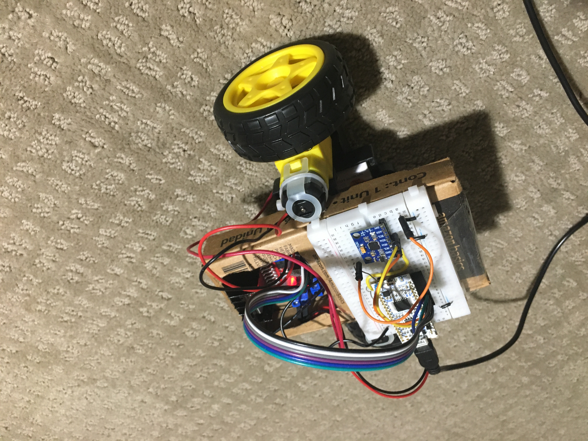
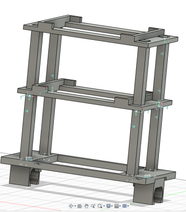
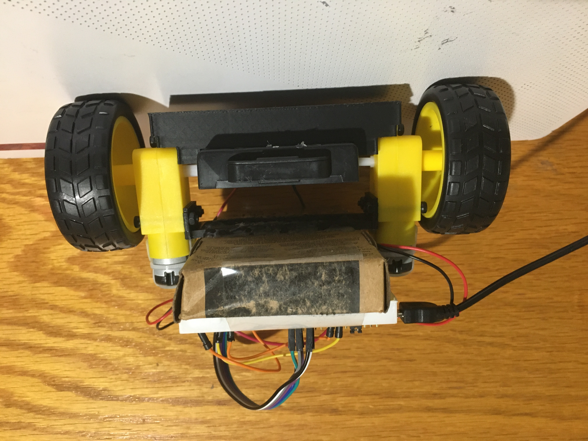

# Two-Wheeled Self-Balancing Robot Blog
Main code is located in: [two_wheel_balance/Core/Src/main.c](https://github.com/RobertFromTX/two_wheeled_balancing_robot/blob/main/two_wheel_balance/Core/Src/main.c)

## Video Demo
https://github.com/user-attachments/assets/53945460-7c7f-4bdc-ada0-24642ccd9668

If the video does not play, refresh the page.

## Project Overview and Goals
Over the summer I created a robot that balances using only two wheels. The robot utilizes a PID control loop and data fed from an accelerometer to maintain an upright orientation. I primarily started this project to learn more about STM32 microcontrollers and how to use their onboard peripherals; however, I also wanted to apply some theory that I learned from my linear control systems class.

## Design and Component Selection
The main design constraint was cost since I only needed this project to be a learning opportunity. What I did not anticipate from setting this design constraint was that it also made the implementation of the control system to be more challenging, which in turn helped me learn about robot control.

The design incorporated components to accomplish the essential tasks required by a typical two-wheeled balancing robot. Below is a list of some of the tasks and how the design addressed them.
 
### Computation
The STM32F303K8 microcontroller on the NUCLEO board was chosen for the design, which is based off of the ARM Cortex-M4 architecture. I opted to use an STM32 microcontroller since I wanted to gain knowledge that can be easily transferred across multiple other vendors, as ARM is ubiquitous in the embedded world. The microcontroller needed to be able to process data from peripherals as well as interact with them. While many microcontrollers would have included the necessary peripherals required for this design (I2C, timers, GPIO), the STM32F303K8 has a built-in FPU (Floating Point Unit), which offers an advantage in handling floating-point computations efficiently. In retrospect, the FPU was not needed to meet the speed requirement as I did not use it. My main resource for learning STM32 in this project was the [Mastering STM32 book](https://www.carminenoviello.com/mastering-stm32/).

### Data Collection
The MPU6050 is a MEMS sensor that essentially functions as both an accelerometer and gyroscope. I used the STM32’s HAL libraries to establish communication between the microcontroller and sensor. The sensor’s interrupt pin was attached to a pin configured in external interrupt mode on the microcontroller. To get the accelerometer and gyro data, I read registers on the MPU6050 using the I2C protocol every time the external interrupt was triggered. The code used to interface with the MPU6050 was not taken from anyone, and I developed it myself by referencing the MPU6050 datasheet and register map documents.

To get a good estimate of the orientation (yaw, pitch, roll), sensor fusion of the gyroscope and accelerometer data had to be done. Although there are many ways to implement sensor fusion, I chose to use a Kalman filter. I chose to not use the digital motion processor built into the MPU6050 because I wanted to learn about digital Kalman filters, since it was not covered in my linear control systems course. Implementing the Kalman Filter was challenging. Not only did it require a decent understanding of math and state space models, proper tuning of the Kalman filter was critical and somewhat tedious. Additionally, the Kalman filter was the most computationally expensive part of the entire system by far due to how many matrices that had to be calculated. To maintain a 250 Hz control loop, I had to increase the CPU clock speed from 8 MHz to 64 MHz. It would definately have been better performance-wise to offload orientation calculations to the digital motion processor, but the main goal of the project was to learn and apply theory. Also, now that I am working on a drone project using the digital motion processor, I realize that it would have been impossible for me to make my own code to utilize it in this project since it requires reverse engineering of the MPU6050 (lots of proprietary information hidden from public). Also in hindsight, it might have been better to use an extended kalman filter due to the non-linear nature of the system, but it really did not seem to cause any issues. 

### Actuation
For moving the wheels, I chose to use the typical yellow TT motors that have a 1:48 gear ratio. I knew that they would be able to generate enough torque because I referenced many other designs since I was completely new to these kinds of robots. Unfortunately, there are many variations of these yellow TT motors, each with varying quality. For me, there was no good way to figure out which vendor to buy these motors from. As a result, I just chose the cheapest.

I originally did try using [motors I had on hand](https://www.amazon.com/EUDAX-Electric-Magnetic-Propeller-Connector/dp/B08GPPJR1T/ref=sr_1_7?dib=eyJ2IjoiMSJ9.euwzs-FIZ8uUvUcZebG2AwPDjpoKrznOKomzM4JBOOGVGGTwzIujBiybnkNjXz7FWtbngpBpExlHhlB2atB9SzjO8lNAbl52d8ORqFhpVYfFqDDaJQMXScG0jXbumvSFZ4TPuzCeOHtCe6XnYgHaQEK7pMo5Xsh56FBXLe0OhpMXXpQ0c6kkGx-OHGoMpkEwOscdJr4WY8Rl9-tU6uv9aRX6mmJxy3-0z7UuZnsE3-CfmDc1bdZHO0dcwKDCb1B1dEJ3e4660wL07Gs4vUw8-SknRRqyApD8eRT8OfuqJlc.7YZenACk3TEVlfXnNBalTBMh_cQ6XKBFJdNVkUwyta4&dib_tag=se&keywords=motor+kit&qid=1754883709&sr=8-7)
, but they seemed to not provide sufficient torque. In retrospect, I still think that those motors would have been feasible since errors in other parts of the design were the main reasons why my initial design did not work.

To drive the motors in both directions, I chose an LM298N breakout board. The LM298N features an H-bridge which allows the motors to be spun in both directions. PWM signals from the STM32 board, which the duty cycle is determined from the PID controller’s output, are sent to the breakout board to control the power output of the motors. To generate PWM signals, I used the timer peripheral on the STM32. Only one PWM signal was required for both motors. The PWM frequency was 16 KHz. Lower PWM frequencies potentially wouldn't allow the control system to smoothly operate while higher frequencies would result in excessive power losses due to switching.

### Control
My linear control systems class mainly taught analog systems. However, since I wanted to implement the PID controller on a microcontroller, I had to convert my analog knowledge to digital. 

I used the trilinear transformation, and then I took the Z transform inverse to turn the analog PID controller into a digital one. From my research, the trilinear transform typically yields good results for matching the behavior of analog systems in a digital domain.

The PID control was the most challenging part of the project, with many flaws in the initial PID controller’s design. Initially for the integral term, I chose a clamp integrator. This was one of the flaws in my original design, but originally I thought it was good to prevent windup (i.e., the output of the integral term could grow to infinity). Since I clamped the integrator so that only enough from the integral term was outputted to get 100% duty cycle, the integral term would frequently get set to 0 and would not contribute at all in the control effort. As a result, the robot would have a tendency to keep leaning to one side, never generating enough power to go back to the other side. Once I completely got rid of any clamping, the robot started balancing much better since the integral term would eliminate any biases. Clamping of the integral term is not really necessary since the robot is constantly tilting back and forth, not allowing the integral term to go to infinity. Another issue I had was that I could not get the motor to move in small increments because there was no direct position control. It turns out that I was not using the derivative term properly. The derivative term allows the motor to make small steps. I was using a pseudodifferentiator, which basically is the pure derivative term and a lowpass filter right after. The issue was that the cutoff frequency I chose was too low, which made the derivative term to have too much delay for the robot to properly balance.

### Housing
The design needed to house the components in a way that also makes balancing easy. Multiple iterations of designs were tested. Initial designs seemed to fail because the motors couldn't generate enough torque to restabilize the robot after tilting a certain amount. I decided to shift to a design that had as low of a center of mass as possible as a result, putting the heavy batteries near the axle of the motors. Most of the body was designed in fusion360 and 3D printed, but I also used a cardboard box to make the robot lighter. In hindsight, I believe the initial designs that I came up with could have worked since I had to fix the PID controller implementation to get the current body to work. From referencing other designs, the key to success seems to make sure the robot barely even tilts.

 Initial design of housing

  
 Current design

## Bill of Materials
Now you may be wondering how much it all costs, right? After all, the main design constraint was the cost. Below is the bill of materials:

Item                     | Quantity               | Unit Price
| ---------------------- | ---------------------- | ---------------------- |
NUCLEO-F303K8            | 1                      | $10.81
Breadboard               | 1                      | $1.43
L298N Motor Driver       | 1                      | $2.87
Motor (with wheels)      | 2                      | $2.42
MPU6050 Sensor           | 1                      | $3.66
Rechargable Batteries    | 4                      | $3.62

In the end, the total cost of everything on the robot was about $38.09. However, the cost of the batteries should not be factored into this project because they have primarily been used to power other devices I own for years.
As a result, the real expense of the project was around $23.61. The price is not bad at all, but future improvements could be made by soldering the components to get rid of the breadboard and switching out the microcontroller. 

Below, I have links to all of the supplies:
* [NUCLEO-F303K8](https://estore.st.com/en/products/evaluation-tools/product-evaluation-tools/mcu-mpu-eval-tools/stm32-mcu-mpu-eval-tools/stm32-nucleo-boards/nucleo-f303k8.html)
* [Breadboard](https://www.amazon.com/Breadborad-Solderless-Breadboards-Distribution-Connecting/dp/B082VYXDF1/ref=sr_1_2_sspa?crid=SDEW6HVNRG0&dib=eyJ2IjoiMSJ9.PLUhdbMXMFbDx6oJf_bMxZ0ttRwOv-ebmFmFNeJZpx9ha5w888q79BJJZlU82k2YV6ZQEEheOiWvZjHvTN7uZ2SbSI1aA1Gpe-ZA_QX51Jkil-bmoejsvoiw4CGPBC0WW9WpdfwuQbG_5p6lKrIAb8iStZjUSxymNPRg-pDwt8DafgB28BUmYmXrc1RBDLwTfcEKrmdA32Hr0Vldia6MTbtCHcKCp0Q-KS8I-D79s614ul2E-YOhPiwpFQlq3xcyxMyg2M86j__P9NWY7KUfUqV6ta50QxoeEY7Rgor2t4Y.Y4UIJnps0UOPEyLmgn2eFxMuCQHwsEJx1Ti7IohNonQ&dib_tag=se&keywords=mini+breadboard&qid=1754941983&s=industrial&sprefix=mini+b%2Cindustrial%2C122&sr=1-2-spons&sp_csd=d2lkZ2V0TmFtZT1zcF9hdGY&psc=1)
* [L298N Motor Driver](https://www.amazon.com/HiLetgo-Controller-Stepper-H-Bridge-Mega2560/dp/B07BK1QL5T/ref=sr_1_1_sspa?crid=2U8C6DHZ4XNKC&dib=eyJ2IjoiMSJ9.oufilZ58rX96jak-qSRiK33ypjmiDRjqS5Yq8VlUo1liXzotBXpwb9ZBk3_OQqjFATNy_AOg4jqkZ1KuMPIWikWaZ12fCKf3v5TXeDadR95S0dt0BpQMNzC7OGKMq8g2_ogaz-xnvy5vIPXxHYJRvecGmJ-019tnGDtbXq2-Lw5tUI38TsIaa49IOd40JD8UBdDH7tBS9fDw519SctzId6byWVOY861Fzy_95Og6u8x0-IOEUHT20JM7KxB4Kt_DtzaYmj_u28ra3JdyA9BlGbPcNFRYfTqnt_Iz14lNdug.jDoLDlGRLw3vrFK2w7_LhesS-hB-31kOR-0xmt11PXQ&dib_tag=se&keywords=l298n&qid=1754940031&s=industrial&sprefix=l298n%2Cindustrial%2C102&sr=1-1-spons&sp_csd=d2lkZ2V0TmFtZT1zcF9hdGY&psc=1)
* [Motor (with wheels)](https://www.amazon.com/Motor-Leads-Gearbox-Shaft-200RPM/dp/B0D8H89XDY/ref=sr_1_7?crid=2BZ5IHZPG749T&dib=eyJ2IjoiMSJ9.e1GYOJfYNxPBvtk9OgggJ_x6u3kK-4C6XcGciXYQTi7UnE1Y86DcvECbPN1P7T5ej_4RBP3C8a92f4LGRnPf0o8bLyrcMxnp6ySuGeGXt3XM-l42s9iUlTRgtHLursA15E1adOOLyuBnx7ibUdjKouyF95HWOk8jjysKG17GqeHMG0emoMh7bAc5pKIYaAKPxknobCJ978qfegOHznCdZXW7yH6I0Ql2pHQcMSS4unVpzl0xrZfPhKdGLln9k-PwdVOqPPftn29F_enKHJ8omjkZKb1hoLH6lJ_Gi0RiBBU.SyMmZ2heIei_8proDfCc80K3lOu3AnYDMRGqFxCeZ4U&dib_tag=se&keywords=motor&qid=1750655042&s=industrial&sprefix=motor%2Cindustrial%2C115&sr=1-7)
* [MPU6050 Sensor](https://www.amazon.com/HiLetgo-MPU-6050-Accelerometer-Gyroscope-Converter/dp/B00LP25V1A/ref=sr_1_3?crid=2VCWFM8SCSONC&dib=eyJ2IjoiMSJ9.PFxAcjN15dzv7m-hyOAdWNb9GRzkue-Rj2CKSzL6qDxnH88h9VHGb0kcqQeOLr1bagwTYC5a-HUkyRF_RjLSqDe7VPfuxY2yyE9nbUB9VAaWOsOgFECWlRAqqF-zMKliF789TQMwVSJfqDWfG4N39bMnrqYpL6ValNG2VIG1mqfQa4lPK1wEHUdJv4hmV0XsIxE-STjJIbZk5SNXL28B1Nv3NQE4q4DM1UZ9SU8jcho.3Q_H7QZpQGeuzY6RNNa5wHJzMaopk68maWU7Qn8OK90&dib_tag=se&keywords=accelerometer&qid=1745891003&sprefix=accelero%2Caps%2C157&sr=8-3&th=1)
* [Rechargable Batteries](https://www.amazon.com/Eneloop-8-Battery-Rechargeable-Batteries-Controllers/dp/B00JHKSN5I/ref=sr_1_1_sspa?crid=MKJUFXLW5P8F&dib=eyJ2IjoiMSJ9.7a9PIgYRnKL4x3tKkiEs56yu_12yfkCUqNxUUQbzx-p5ART-nyvz9DokGDF4pJaed4VReGPVMJr_7OG-iYOiptiCg-zQeEzuyiGaweCTkYlFZTR0XbvRd9Ir0VqyHeC-68SGu6_oNTefHPSK3se5Nuelvx7aabdmh1na4SkY3B5flyfeYpgwKS960w9h3I8BK7-8wwO6a0Xkq_wClmow4qhGFNXuT-mLNFizg8Ks0QeNKOCGEyhNnAKofb7NIJpbFDv5AHBqQNyjmTLlEeaDKCszo5Fh37VFZsdLmk2Hu9U.kQfaLlxgv31vv4Df1frwIKZO8LMSafnM2QKAuHLctB4&dib_tag=se&keywords=eneloop%2Brechargeable%2Bbatteries&qid=1754942112&sprefix=enelope%2Bre%2Caps%2C147&sr=8-1-spons&sp_csd=d2lkZ2V0TmFtZT1zcF9hdGY&th=1)
## Results and Takeaways
Making a two-wheeled self-balancing robot is no trivial task, especially if it is your first time. [One guy even spent 6 years perfecting his!](https://www.youtube.com/watch?v=poWtPWG1nvM&t=150s). I have gained tons of intuition going forward into the future. Clearly, from my video demo, the result of this project is far from perfect as it does oscillate a lot. There are many possible reasons. The most probable reason is that the minimum speed of the motors are too high. The motors only start spinning after a certain PWM duty cycle is met due to a combination static friction and load on the motors. A higher gear ratio would have probably been better for this project so that smaller adjustments can be made. In retrospect, every design I saw actually working using similar motors had lower RPM's than mine. As mentioned earlier, having the cost constraint did make this project more challenging. With a lower RPM motor, I likely would have had more leeway with the PID controller implementation since I do not believe that a properly working derivative term would have been necessary. Additionally, it is plausible that my version of the clamp integrator could have worked since the lower motor speed would allow the robot to stay closer to the setpoint more easily.

I have learned a lot about the STM32 and control methodologies from completing this project, and I am really glad that I took part in this challenge. I now have the basic framework for two wheeled robots, and I can try out many other designs quickly. As for improvements, I can implement additional features such as remote control or maybe even create my own segway in the future.
